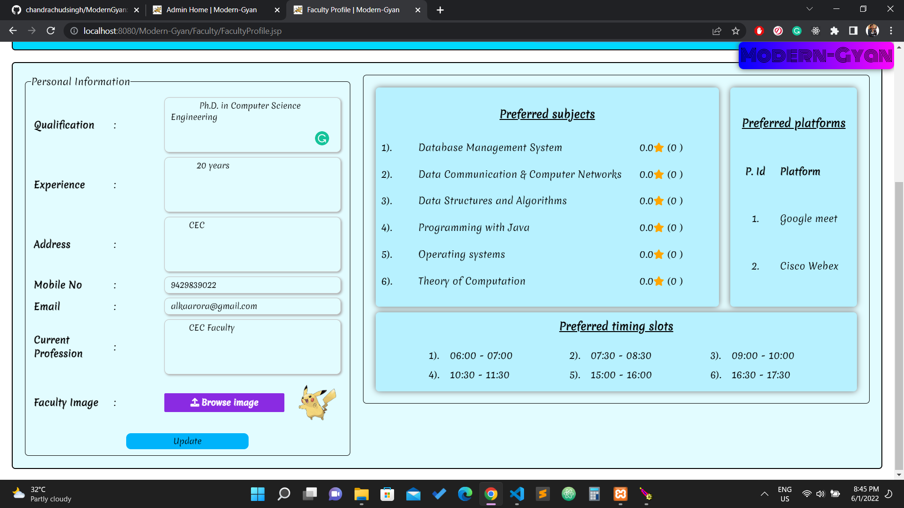

# ModernGyan
- Web Application developed for online learning of Engineering courses and topics from different mentors at a prefered time slot on the prefered platform.
- The project was built in Java using HTML, CSS, JavaScript, JSP, and SQL while learning Advanced Java (web).

## Aim
The main aim of this project is to build a platform where Engineering Students can learn Engineering related sujects and topics live from their prefered mentors (based on the ratings) on their prefered time slot. Students can search through various courses according to their engineering branch, whether it might be a subject or a mere topic of a particular subject. The teachers are verified by the admin on their registration and then approved or rejected. Teachers can update their comfortable timings and subjects on their profile.

## Prerequisites
- Java jdk 8 or above
- Apache Tomcat (version 9) local server
- Eclipse IDE for Java
- MySQL jdbc connector for connecting SQL with jdbc driver
- and XAMPP for database (SQL)

## Run Project
- Start XAMPP for Apache HTTP Server, MariaDB database.
- Start Tomcat9 Daemon Servuce manager.
- Load your project on [localhost:8080](http://localhost:8080).

- You can view your database on [phpmyadmin](http://localhost/phpmyadmin/).

## Feature & Functions

### Student/Faculty Panel

#### <ins>Student/Faculty Login Page</ins>
Login Page for students and faculty. There is also an option for New users to register.

#### <ins>Student Registration Page</ins>
Students can register immediately as soon as they fill all the details.

#### <ins>Faculty Registration Page</ins>
Faculty members are verified by the Admin after there registration is complete.

#### <ins>Registration Success Login Page</ins>

#### <ins>Home Page</ins>
Home Page Without Login -

### Student Panel

#### <ins>Student Home Page</ins>
Displays student's Upcoming, Ongoing & Finished courses, and top 5 subjects & top 5 topics from his/her branch.

#### <ins>Find Course Page</ins>
Lets user filter subjects and topics branch-wise, and also users can search directly from SearchBar.

#### <ins>Course Enroll Page</ins>
Shows details about the chosen course along with faculties available for the same. Student can select the timing slot and platform for learning the course from a particular faculty.

#### <ins>Course Enrollment Success Message</ins>
Displays the message for successful enrollment in the course.

### Faculty Panel

#### <ins>Faculty Home Page</ins>
Displays Upcoming, Ongoing & Completed courses by the faculty. And also displays a panel where the faculty can update his/her preferences.

#### <ins>Faculty Profile Page</ins>
Displays faculty's profile and preferences and a means to update his/her profile details.

### Admin Panel

#### <ins>Admin Login Page</ins>
Login Page for admins.

#### <ins>Admin Home Page</ins>
It displays:-
- Total number of registered & active students from each branch and total number of faculties present.
- Faculty brief profiles.
- And a SearchBar to search faculties

#### <ins>Admin - Faculty Profile view Page</ins>
For viewing the general profile of faculties.

#### <ins>Add Admin Page</ins>
Admins can make another admin here.

Admin Added Successful message

#### <ins>Add Branch Page</ins>
Admins can add a branch to the database here.

Branch Added Successful message

#### <ins>Add Subject Page</ins>
Admins can add a Subject to the database here.

Subject Added Successful message

#### <ins>Add Topic Page</ins>
Admins can add a Topic of a particular subject to the database here.

Topic Added Successful message

#### <ins>Request Page</ins>
All the students course enrollment request shows here. From here admin can either accept it or reject it.

